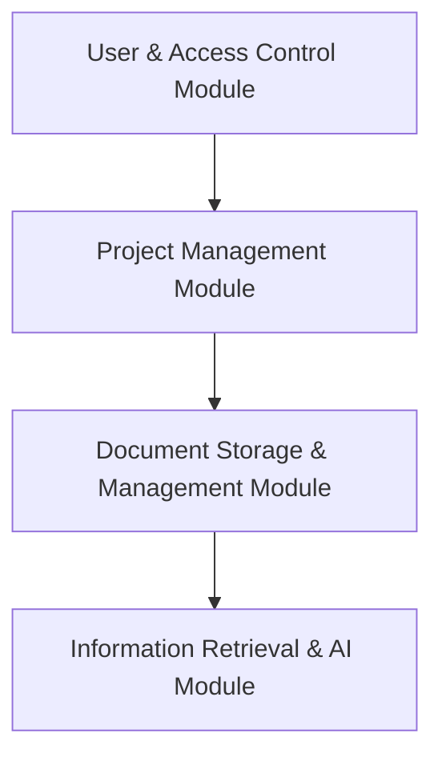

# System Patterns: Project Document Management System

## Architecture Overview

### Clean Architecture Pattern
The system follows **Clean Architecture** principles with Domain-Driven Design (DDD):

```
Domain Layer (Core) → Application Layer → Interface Layer → Infrastructure Layer (External)
```

**Pattern Benefits**:
- Clear separation of concerns with domain model at the center
- Business rules isolated from external dependencies
- Improved testability and maintainability
- Flexibility to change infrastructure components

### Domain-Driven Design Pattern
Implements **Domain-Driven Design** to model complex business domains:

```
Aggregates → Repositories → Services → Application Layer
```

**Key Components**:
- **Aggregates**: User, Project, Document as root entities
- **Value Objects**: Immutable objects like DocumentMetadata
- **Repositories**: Domain-centric data access interfaces
- **Domain Services**: Complex operations spanning multiple entities

### Retrieval-Augmented Generation Pattern
Uses **RAG Pattern** for AI-powered document queries:

```
User Query → Vector Embedding → Similarity Search → Context Retrieval → LLM Generation
```

**Implementation Strategy**:
- Convert documents to vector embeddings during indexing
- Transform user questions to compatible vector representation
- Retrieve most relevant document chunks as context
- Generate answers using LLM with retrieved context
- Track source references for verification

## Key Design Decisions

### 1. Local Storage with Database Metadata
- **Decision**: Store physical files in filesystem, metadata in database
- **Rationale**: Balance between performance and structured organization
- **Implementation**: StorageService manages files, database tracks metadata

### 2. Modular System Architecture


**Rationale**: Each module has clear responsibilities and dependencies

### 3. Stateless Authentication with JWT
- Token-based authentication for scalability
- Role-based authorization at both system and project levels
- **Rationale**: Supports stateless scaling and fine-grained permissions

## Component Relationships

### Module Interactions
- **User & Access Control** → **Project Management**: User roles determine project access
- **Project Management** → **Document Storage**: Projects contain documents and folders
- **Document Storage** → **Information Retrieval**: Documents are indexed for search and AI
- **All Modules** → **API Layer**: RESTful endpoints expose functionality

### Data Flow Patterns

#### Document Upload Flow
1. User authenticates and selects project
2. User uploads document to specific folder
3. System stores file and creates metadata
4. Background process extracts text content
5. Content is indexed for search
6. Vector embeddings are generated for AI retrieval

#### Document Search Flow
1. User submits search query
2. System performs full-text search in Elasticsearch
3. Results are filtered based on user's access permissions
4. Relevant documents are returned with metadata
5. User can view or download documents

#### Chatbot Query Flow
1. User asks question in natural language
2. Question is converted to vector embedding
3. System finds most similar document chunks
4. Retrieved context is sent to LLM with question
5. LLM generates response based on context
6. Response is returned with source references

## Database Schema Design

### Entity Relationship Pattern
```
Users ──┬── Projects ──┬── Folders ──── Documents ──── Document Versions
        │              │
        └── User Roles └── Project Members
```

### Key Relationships
- Users have system-level roles
- Projects have members with project-specific roles
- Projects contain folders in a hierarchical structure
- Folders contain documents
- Documents have versions with physical file references

## API Design Patterns

### RESTful Resource Pattern
- Resources exposed through consistent endpoints
- HTTP methods map to CRUD operations
- Pagination for large result sets
- Filtering and sorting capabilities

### Security Patterns
- Authentication via JWT tokens
- Role-based authorization checks
- Input validation to prevent injection
- Rate limiting to prevent abuse

## Frontend Architecture

### Component-Based Pattern
- Reusable UI components with clear responsibilities
- Container/Presentational component separation
- Custom hooks for shared logic
- Global state management with Redux

### Responsive Design Pattern
- Fluid layouts that adapt to different screen sizes
- Mobile-first approach for core functionality
- Progressive enhancement for desktop features
- Consistent user experience across devices

## Performance Optimization Patterns

### Lazy Loading Pattern
- Load components and data only when needed
- Implement pagination for large datasets
- Use infinite scrolling for document lists
- Progressive loading for large documents

### Caching Strategy
- Cache frequently accessed data
- Implement HTTP caching headers
- Use in-memory caching for database queries
- Client-side caching for static assets 