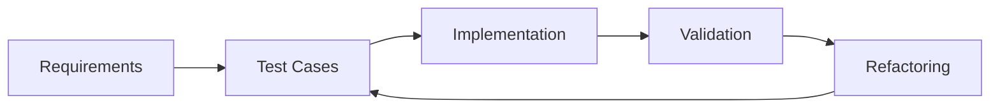
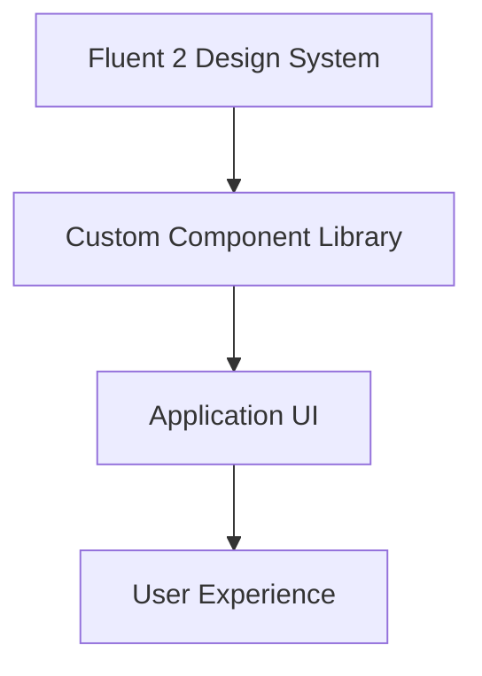

# System Patterns: Project Document Management System

## Architecture Overview

### Clean Architecture Pattern
The system follows **Clean Architecture** principles with Domain-Driven Design (DDD):

```
Domain Layer (Core) → Application Layer → Interface Layer → Infrastructure Layer (External)
```

**Pattern Benefits**:
- Clear separation of concerns with domain model at the center
- Business rules isolated from external dependencies
- Improved testability and maintainability
- Flexibility to change infrastructure components

### Domain-Driven Design Pattern
Implements **Domain-Driven Design** to model complex business domains:

```
Aggregates → Repositories → Services → Application Layer
```

**Key Components**:
- **Aggregates**: User, Project, Document as root entities
- **Value Objects**: Immutable objects like DocumentMetadata
- **Repositories**: Domain-centric data access interfaces
- **Domain Services**: Complex operations spanning multiple entities

### JWT Authentication Pattern
Implements **JWT-based authentication** for secure, stateless user sessions:

```
Login Request → Authentication → Token Generation → Token Validation → Protected Resources
```

**Implementation Components**:
- **JwtTokenProvider**: Generates and validates JWT tokens
- **JwtAuthenticationFilter**: Intercepts requests to validate tokens
- **AuthService**: Handles login, token refresh, and logout operations
- **SecurityConfig**: Configures security policies and JWT handling

**Token Strategy**:
- Access tokens with 30-minute expiration
- Refresh tokens with 7-day expiration
- Token-based user identification and role authorization
- Stateless authentication for scalability

### Retrieval-Augmented Generation Pattern
Uses **RAG Pattern** for AI-powered document queries:

```
User Query → Vector Embedding → Similarity Search → Context Retrieval → LLM Generation
```

**Implementation Strategy**:
- Convert documents to vector embeddings during indexing
- Transform user questions to compatible vector representation
- Retrieve most relevant document chunks as context
- Generate answers using LLM with retrieved context
- Track source references for verification

### Containerization Pattern
Implements **Docker Containerization** with multi-service architecture:

```
Docker Compose → Service Containers → Volume Persistence → Network Communication
```

**Implementation Approach**:
- Separate containers for each service (backend, frontend, database, search)
- Service isolation with defined dependencies
- Volume mounts for data persistence
- Docker network for inter-service communication
- Environment-specific configurations (dev vs. prod)

### Test-Driven Development Pattern
Implements **TDD Pattern** for ensuring code quality and functionality:

```
Write Test → Test Fails → Implement Feature → Test Passes → Refactor
```

**Implementation Approach**:
- Write unit tests before implementing features
- Create test cases based on requirements
- Implement minimum code to pass tests
- Refactor while maintaining test coverage
- Apply TDD to both backend and frontend development

**Testing Layers**:
- Unit tests for isolated components
- Integration tests for component interactions
- End-to-end tests for critical user flows
- Component tests for frontend UI

### Fluent 2 Design Pattern
Implements **Fluent 2 Design** for consistent, modern user interface:

```
Design System → Component Library → Application UI
```

**Implementation Approach**:
- Custom components following Fluent 2 Design principles
- Consistent styling and interaction patterns
- No floating buttons (per requirements)
- Clean, intuitive user interface
- Responsive design for different screen sizes

**Key UI Components**:
- Button: Standard interaction element
- Toast: Notification system
- ChatbotInterface: AI interaction component
- Modal dialogs: For forms and confirmations
- List components: For displaying collections of items

## Key Design Decisions

### 1. Local Storage with Database Metadata
- **Decision**: Store physical files in filesystem, metadata in database
- **Rationale**: Balance between performance and structured organization
- **Implementation**: StorageService manages files, database tracks metadata
- **Docker Integration**: Volume mount at /app/uploads for persistence

### 2. JWT-Based Authentication
- **Decision**: Use JWT for authentication with dual token approach
- **Rationale**: Provides secure, stateless authentication with good user experience
- **Implementation**:
  - Short-lived access tokens (30 minutes) for API authorization
  - Long-lived refresh tokens (7 days) for obtaining new access tokens
  - BCrypt password encoding for secure credential storage
  - Role-based authorization with Spring Security
  - Token validation through custom filter chain

### 3. Modular System Architecture


**Rationale**: Each module has clear responsibilities and dependencies

### 4. Containerized Deployment Model


**Rationale**: Service isolation with clear boundaries and scalability

### 5. Test-Driven Development Approach


**Rationale**: Ensures code quality, maintainability, and adherence to requirements

### 6. Fluent 2 Design Implementation


**Rationale**: Provides consistent, modern user interface following project requirements

## Component Relationships

### Module Interactions
- **User & Access Control** → **Project Management**: User roles determine project access
- **Project Management** → **Document Storage**: Projects contain documents and folders
- **Document Storage** → **Information Retrieval**: Documents are indexed for search and AI
- **All Modules** → **API Layer**: RESTful endpoints expose functionality

### Authentication Flow
1. User submits credentials to `/api/auth/login` endpoint
2. System validates credentials against stored password hash
3. System generates access token and refresh token
4. Tokens are returned to client with user details
5. Client includes access token in Authorization header for subsequent requests
6. When access token expires, client uses refresh token to get new tokens
7. User can explicitly logout to invalidate tokens

### Data Flow Patterns

#### Document Upload Flow
1. User authenticates and selects project
2. User uploads document to specific folder
3. System stores file and creates metadata
4. Background process extracts text content
5. Content is indexed for search
6. Vector embeddings are generated for AI retrieval

#### Document Search Flow
1. User submits search query
2. System performs full-text search in Elasticsearch
3. Results are filtered based on user's access permissions
4. Relevant documents are returned with metadata
5. User can view or download documents

#### Chatbot Query Flow
1. User asks question in natural language
2. Question is converted to vector embedding
3. System finds most similar document chunks
4. Retrieved context is sent to LLM with question
5. LLM generates response based on context
6. Response is returned with source references

### Testing Flow Patterns

#### Backend Testing Flow
1. Define test cases based on requirements
2. Implement unit tests for services and repositories
3. Create integration tests for API endpoints
4. Develop feature implementation
5. Validate against test cases
6. Refactor as needed while maintaining test coverage

#### Frontend Testing Flow
1. Create component test specifications
2. Implement component tests with Jest and React Testing Library
3. Develop UI components
4. Validate component behavior against tests
5. Create end-to-end tests with Playwright for critical flows
6. Validate complete user journeys

## Database Schema Design

### Entity Relationship Pattern
```
Users ──┬── Projects ──┬── Folders ──── Documents ──── Document Versions
        │              │                      │
        └── User Roles └── Project Members    └──── Document Content
```

### Implemented Schema Structure
- **Users**: User accounts with authentication details
  - Properties: id, email, password_hash, name, created_at, updated_at
  
- **Roles**: System-level user roles
  - Properties: id, name
  
- **User Roles**: Mapping between users and their system roles
  - Properties: user_id, role_id
  
- **Projects**: Project entities with metadata
  - Properties: id, name, description, status, created_at, updated_at, created_by
  
- **Project Members**: Users associated with projects and their roles
  - Properties: project_id, user_id, role, added_at, added_by
  
- **Folders**: Hierarchical folder structure within projects
  - Properties: id, project_id, parent_folder_id, name, created_at, created_by, display_order
  
- **Documents**: Document metadata stored in the database
  - Properties: id, folder_id, name, mime_type, size, created_at, created_by, display_order
  
- **Document Versions**: Version control for documents
  - Properties: id, document_id, version_number, storage_path, size, created_at, created_by
  
- **Document Content**: Extracted text content for search indexing
  - Properties: id, document_version_id, content_text, indexed_at, embedding_status
  
- **Chatbot Conversations**: User conversations with the AI chatbot
  - Properties: id, user_id, project_id, started_at, last_message_at
  
- **Chatbot Messages**: Individual messages in chatbot conversations
  - Properties: id, conversation_id, message_type, content, sent_at
  
- **Chatbot References**: Document references for chatbot responses
  - Properties: id, message_id, document_id, relevance_score

### Key Relationships
- Users have system-level roles
- Projects have members with project-specific roles
- Projects contain folders in a hierarchical structure
- Folders contain documents
- Documents have versions with physical file references
- Document versions have extracted content for search
- Chatbot conversations are linked to users and optionally projects
- Chatbot messages reference source documents

## API Design Patterns

### RESTful Resource Pattern
- Resources exposed through consistent endpoints
- HTTP methods map to CRUD operations
- Pagination for large result sets
- Filtering and sorting capabilities

### Authentication API Pattern
- **Login Endpoint**: `POST /api/auth/login`
  - Accepts email and password
  - Returns JWT tokens and user details
  - Implements proper error handling for invalid credentials

- **Refresh Endpoint**: `POST /api/auth/refresh`
  - Accepts refresh token
  - Validates token authenticity and expiration
  - Issues new access and refresh tokens

- **Logout Endpoint**: `POST /api/auth/logout`
  - Requires authentication
  - Invalidates user session
  - Returns success status

### Security Patterns
- Authentication via JWT tokens
- Role-based authorization checks
- Input validation to prevent injection
- Rate limiting to prevent abuse

## Frontend Architecture

### Component-Based Pattern
- Reusable UI components with clear responsibilities
- Container/Presentational component separation
- Custom hooks for shared logic
- Global state management with Redux

### Fluent 2 Design Pattern
- Clean, modern UI following Fluent 2 Design principles
- Consistent component styling and behavior
- No floating buttons (per requirements)
- Custom component library instead of Tailwind CSS
- Responsive design for different screen sizes
- Accessibility considerations in component design

### Responsive Design Pattern
- Fluid layouts that adapt to different screen sizes
- Mobile-first approach for core functionality
- Progressive enhancement for desktop features
- Consistent user experience across devices

## Performance Optimization Patterns

### Lazy Loading Pattern
- Load components and data only when needed
- Implement pagination for large datasets
- Use infinite scrolling for document lists
- Progressive loading for large documents

### Caching Strategy
- Cache frequently accessed data
- Implement HTTP caching headers
- Use in-memory caching for database queries
- Client-side caching for static assets

## Infrastructure Patterns

### Container Orchestration Pattern
- Docker Compose for multi-container management
- Service dependencies and startup order
- Resource allocation and limits
- Health checks for service monitoring

### Data Persistence Pattern
- Volume mounts for database storage
- Volume mounts for document storage
- Elasticsearch data persistence
- Vector database persistence

### Environment Separation Pattern
- Development environment with debug settings
- Production environment with optimized settings
- Environment variable injection for configuration
- Nginx reverse proxy for production 